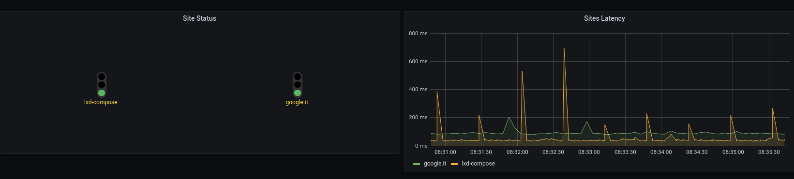

# web-keepaliver

[](https://travis-ci.com/geaaru/web-keepaliver)

[](https://coveralls.io/github/geaaru/web-keepaliver)

Web Services monitoring system that generates metrics to Kafka's Brokers.

It supplies two different programs that are configurable through YAML files:

 * **web-keepaliver-producer**: the service that runs HTTP/HTTPS probes
   to check site status and latency. After the creation of these metrics,
   it sends messages to Kafka Broker (in JSON format) to configured topics.

  * **web-keepaliver-consumer**: the service fetches the messages from Kafka
    Brokers, parses the messages, and stores in TimescaleDB. The TimescaleDB
    is an extension of the PostgreSQL database.

Both tools using the async development pattern.

The stored data are read and displayed from a Grafana dashboard:



## Configuration files

Inside the configuration file of the `web-keepaliver-producer` tool it's
possible to define the list of the sites to monitoring and for every site
one or more resources to check.

As visible in the [example](etc/keepaliver-producer.yaml) the `websites`
section could be defined in this way:

```yaml
websites:
  - name: "google.it"
    topic: "web-keepaliver"
    # Accept or not self signed certificates.
    verify_ssl: true
    # Define the max connection timeout in seconds.
    request_timeout_sec: 120

    # Define basic authentication
    # basic_auth:
    #   user: "xxx"
    #   pass: "yyy"

    resources:
      - name: "google-homepage"
        url: "https://www.google.it"
        method: GET
        # Define optional headers map
        # headers:
        #   Content-Type: "application/json"
        expected_http_code: 200
        # Optional response check through a regex.
        # expected_body_pattern: ''

  - name: "lxd-compose"
    topic: "web-keepaliver"
    # Accept or not self signed certificates.
    verify_ssl: true
    # Define the max connection timeout in seconds.
    request_timeout_sec: 120

    resources:
      - name: "homepage"
        url: "https://mottainaici.github.io/lxd-compose-docs/"
        method: GET
        expected_http_code: 200
        # Optional response check through a regex.
        expected_body_pattern: '.*DANIELE.*'

      - name: "documentation"
        url: "https://mottainaici.github.io/lxd-compose-docs/docs"
        method: GET
        expected_http_code: 200
        # Optional response check through a regex.
        expected_body_pattern: 'lxd-compose'
```

Where a `site` could be defined with:

 * `name`: user-friendly name of the site/node to monitoring
 * `topic`: the name of the Kakfa Broker topic to use
 * `verify_ssl`: disable/enable SSL certificate check. Set to `false` for
   self signed certificates normally.
 * `request_timeout_sec`: define the max connection timeout in seconds.
 * `basic_auth`: this section permit to define a Basic Authentication
   for probe the target resources
 * `resources`: it contains the list of the URL to probe.

Every `resource` could be defined with:

  * `name`: user-friendly name of the URI
  * `url`: the URL to call
  * `method`: The HTTP method to use. Default is GET.
  * `headers`: (optional) could be define the map of headers to sent
  * `expected_http_code`: the expected HTTP Response Code.
    The default value is 200.
    If the code is not equal then the message sent over Kafka
    will contains the failure status.
  * `expected_body_pattern`: (optional) used to check


## Developers stuff

The database schema is initialized through the
[database-release-manager](http://geaaru.github.io/database-release-manager/)
that at the moment has a limited number of
functions on PostgreSQL. We use it to automize the setup of the target database
and in the near future to trace and compiles indexes.

Hereinafter, some examples about using the target database after that is been
configured the `dbrm/dbrm-profiles/dev.conf` file with right access data
```shell
$> cd dbrm/
$> # Access to database shell
$> dbrm psql shell
$> # Show schema tables.
$> dbrm psql show --tables
$> # Compile the SQL file
$> dbrm psql compile --file script.sql
```

The tool `dbrm` permits to manage SSH tunnelling to reach database over SSH channel.
```shell
$> dbrm ssl
===========================================================================
Module [ssl]:
---------------------------------------------------------------------------
	long_help               Show long help informations
	show_help               Show command list.
	version                 Show module version.
	create                  Add a new entry to tunnel master data inside
	                        dbrm database.
	enable                  Active an existing tunnel.
	disable                 Disable an active tunnel.
	list                    Show list of tunnels.
	init                    Initialize SSL extension.
	deinit                  Remove SSL extension table.
	delete                  Delete an entry from tunnel list.
---------------------------------------------------------------------------
===========================================================================
$>
```

### LXD Compose

To see all available projects.

```shell
$> cd ci/lxd-compose
$> lxd-compose project list
- web-monitoring
- travis-test
```

#### Project web-monitoring

To simplify the developer life we use [lxd-compose](https://mottainaici.github.io/lxd-compose-docs/)
to setup the complete services chain locally that is needed to test the application.

In particular, the service is managed by these containers:

  - one container/service with [Kafka Broker](https://kafka.apache.org/)
    (standalone installation) with Zookeeper (v.2.7.0)
  - one container/service with [TimescaleDB](https://www.timescale.com/)
  - one container/service where are executed the **web-keepaliver-producer** and
    **web-keepaliver-consumer** tools.
  - one container/service with [Grafana](https://grafana.com/)

#### Project travis-test

A fast way to test the travis environment with the system python3 version (Python 3.8).

Run the test
```shell
$> cd ci/lxd-compose && lxd-compose apply travis-test
```

On success the container is automatically destroyed else it's needed run the command:

```shell
$> cd ci/lxd-compose && lxd-compose destroy travis-test
```

### Indentation & Code Style

See PEP-0008.

